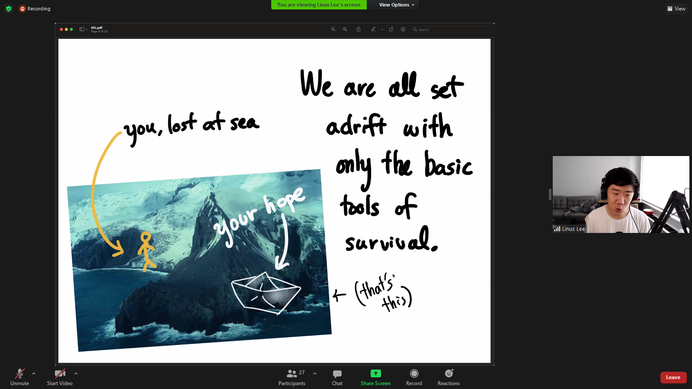
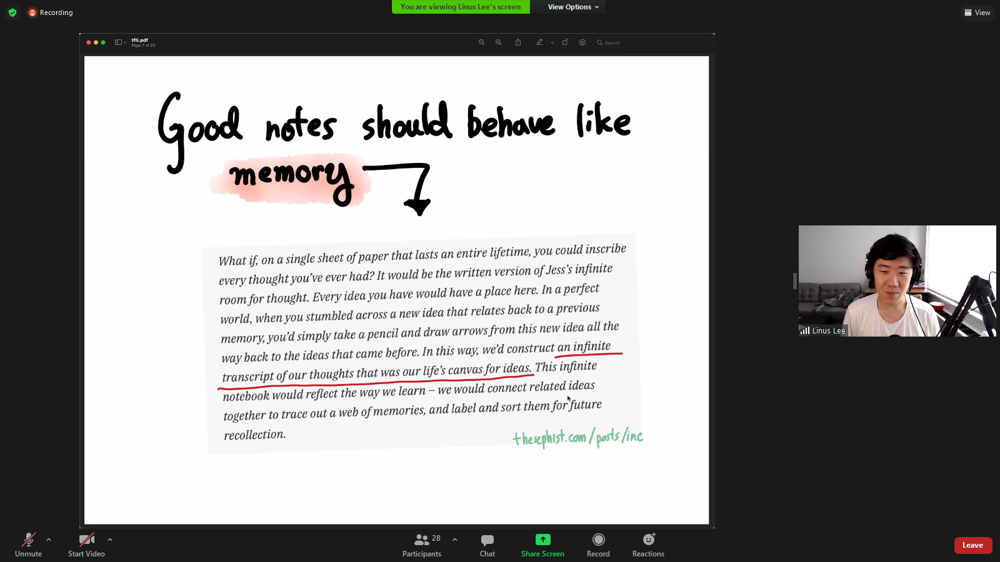

#FtFI 2021 07 28

Linus Lee

9am - Linus Lee, 9:30am - Kevin Lin (Dendron), 10am - Rafael Nepo (mee.cc)

# Incremental note taking

gardening
more like
chronolo

good notes should behave like a memory

context
infinite transcript of your thoughts that was our life's canvas for ideas

Captured ideas > missed ideas
fast lightweight always available

adding > updating ideas

destructive

write right where u reference

  append first

  supersede

  Ideas cnat recall are worse than useless

  effective reacall
  seazrch
  connections

  connections reminders

  backlong references

  contextual reminders

  time is essential
  to how we remember

  knowledge in the context of time
  Linus Lee

  

  

"Highliht first rather than graph first"

Monocle

12.000 docs

realtime 

json index

Search happens in the browser

Searching Google is disvoeery

searching my path`
trigram index

APSE a Personal search Engine
Dogsheep.github.io

From Jess Martin to Everyone:  06:22 PM
re: real-time feedback, my fav feature of my note-taking system is the live autocomplete across my notes when I type [[. But that's just titles! Would love a full index.

search brings up the tools that can do infinite

shared storage layer

https://mymind.com/ has a pretty powerful image search, i’ve been surprised how good it is at matching words to the content of images

Linus you said something like "Highlight first rather than graph first"

ingesdt and search one flow

indexing pocket

Linus Lee

Personal append

kevin8

kevinslin.com

hierarchical knowledge base
local firstbuilt into the IDE 

Excell

type system for your notes

YAML

vaults folder
work/Personalpublishe/private

NPM for docs

mode is composable

you get that because

easy to publish discover

XML sfailed

realy hard to sepcigy format

the only structure is the hiearach

Make Knowledge more like Code

Comoposable
modular 
re-usable

partition 
your knowledge

find ans share all the things you are thinking about

start from a blank page
articulate my learning

Everything is a conversation
remix, articulation, discovery 

make code more like learning

Boris!!!!

namespaces
moderation
reputation

`
# Rafael Nepo

You do not know something exist until you stumble upon *

organize things in a modular function Trail
and Cards
form a board

Organize and present information

make full screen that go

templates for a card
100s

Calendar Card

Video Cards

Navigation Drawer

filter sort and naviage

by type

oldest to newsest

back of the cards
textyou can find it

Tree starts at a tree
life time endeavour

*

collaborative space for sharing events

Tanni understoru