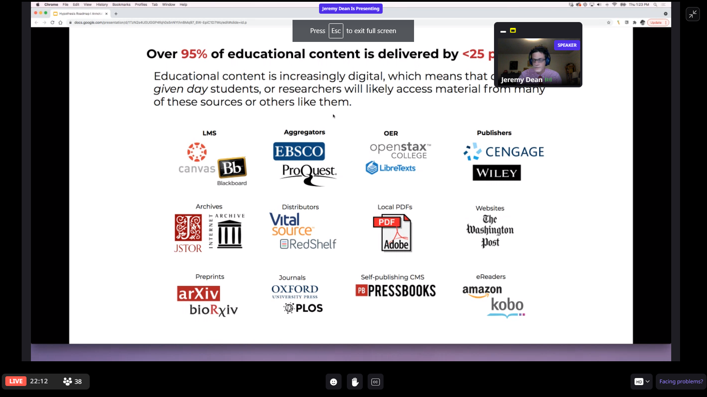

# Hypothesis RoadMap

Google Classroom integration

Student ownership

LMS much more seamless

No signup

extending and deepening 10OWEuLriQpZzSJGq6vCSozZN4M34CNmEC1IrJxqk8xEgoogle drive
canvas speed grader grade books

Canvas filesystem for PDFs
canvas sections smaller group annoitation

Notebook in the LMS appropriate

Instructor dashboard

How annotation data can be surfaced

Bringing Hypothesis annotation into the individuals own knowledge work

peer to peer connections

Canvas Groups
Blackboard files
Canvas Groups
smaller Groups

Ability to host Blackboard Files

What is comming

Vital source integration
content delivery Networks

Video annotation

Student ownership of Hypothesis that they can use parallel privately
and have them Bridged to Note Taking and Tools for Thought Tools

Single signup
domains that ones ownership

unifying SSO across contexts

Give them a personal version

Caliperization
IMS standad for data of Hypothesis activity

File picker functionaility 

biggest opportunity

I want to use it in other spaces

JSTORE

real estate of content
expanding types of texts and places

Chris Kervina

Northern Virginia Community College

· 10 mins ago

Glad to hear about VitalSource. The native annotation in that platform has not been as useful to me as I hoped.

